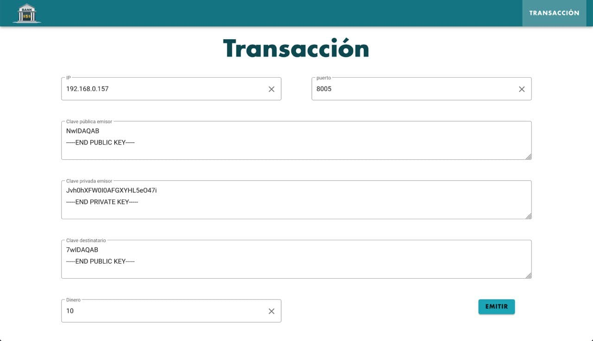
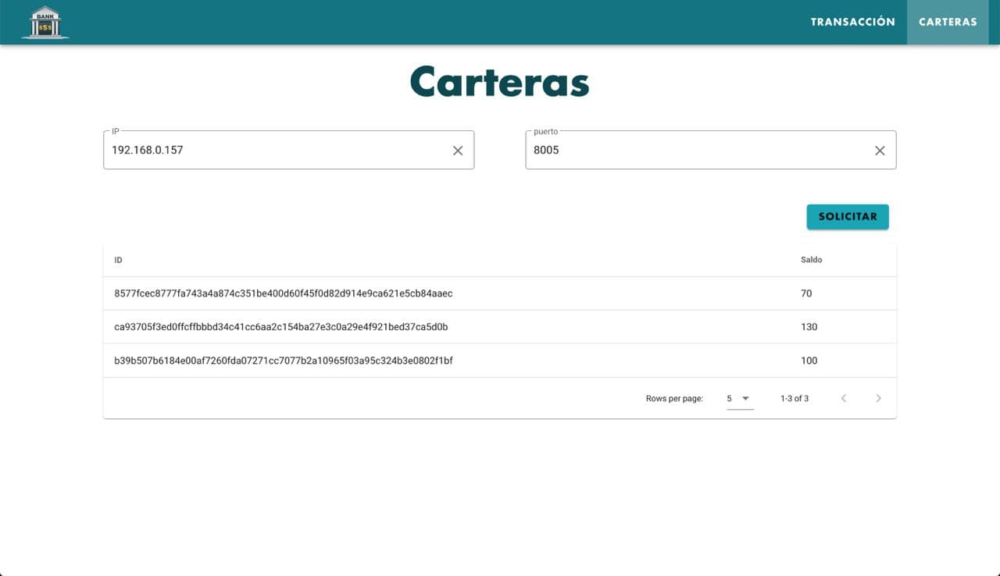
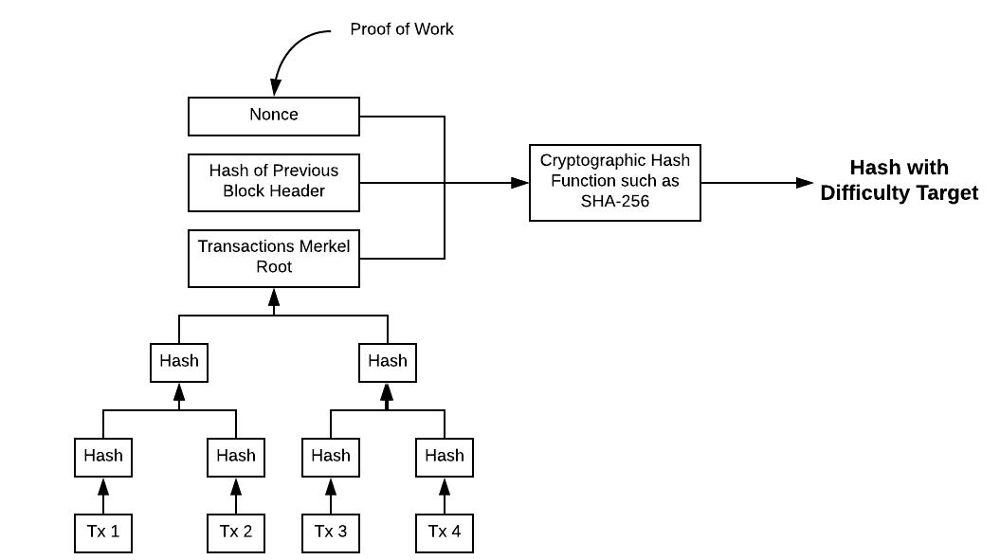
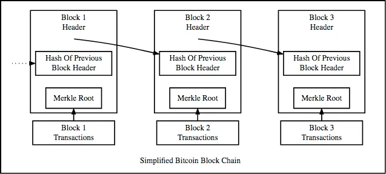
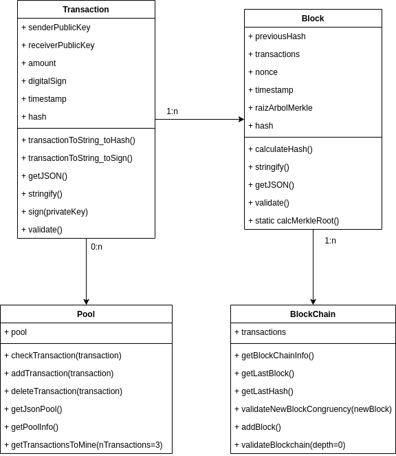
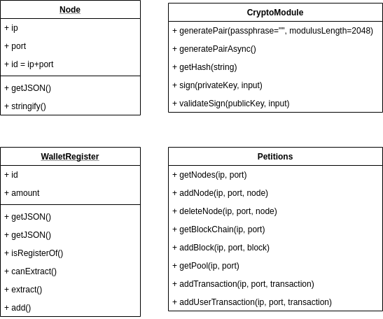

# introduction-to-blockchain
A simple blockchain implementation with distributed nodes/miners + webpage for users' wallet.

The blockchain network can be deployed on multiple computers. A web instance can connect to any existing node. From that moment on, the user can start making transactions with his private key, once he knows the public key of the receiver.

## 1. Webpage:

#### Transactions
users can make transactions through the following form, knowing their private key, the issuer's public key, and selecting the amount of money to send:

#### Wallets
Once a transaction is requested, it is distributed among the network nodes. When the nodes resolve it (one of them finds the next block in the chain), it will be reflected in the wallets of both users:

## 2. Blockchain logic:

#### Block

A block has the following structure:

#### Blockchain
And are linked to each other as follows:

## 3. Developed structures:

### Node/miner
The simplified structure of the classes that make up the node network:

### Webpage
Classes involved in the website

